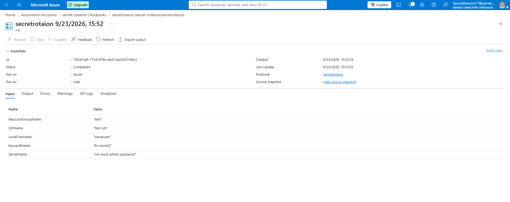
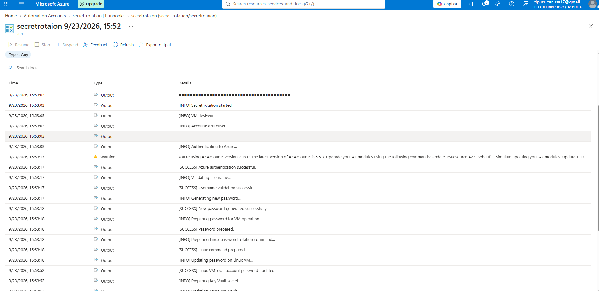
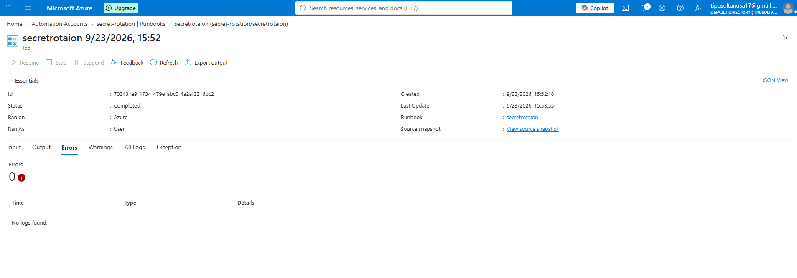
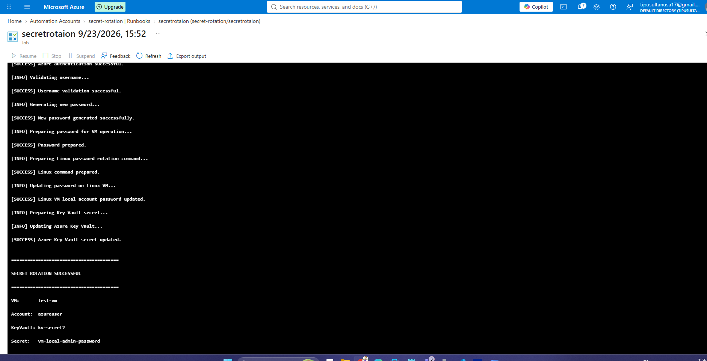

# Azure Secret Rotation Framework

## Overview

This project provides a reusable framework for automatically rotating
local account credentials on Azure virtual machines and securely storing
the updated credentials in Azure Key Vault.

The framework uses Azure Automation and Managed Identity to perform
credential rotation without hardcoding Azure credentials.

## Architecture

Azure Automation
        |
        | Managed Identity
        v
Generate New Password
        |
        v
Azure VM Run Command
        |
        v
Linux VM
        |
        | chpasswd
        v
Update Local Account
        |
        v
Azure Key Vault
        |
        v
Store New Secret Version
        |
        v
Automation Job Logging

## Components

- Azure Automation Account
- System-Assigned Managed Identity
- Azure Linux Virtual Machine
- Azure Key Vault
- PowerShell Runbook
- Azure RBAC

## Rotation Workflow

1. Azure Automation starts the runbook.
2. Managed Identity authenticates to Azure.
3. The framework generates a new password.
4. Azure VM Run Command executes against the Linux VM.
5. The local Linux account password is updated.
6. The operation is validated.
7. The new password is stored in Azure Key Vault.
8. Key Vault creates a new secret version.
9. The Automation job records the result.

## Security

The framework follows several security principles:

- No Azure credentials are hardcoded.
- Managed Identity is used for Azure authentication.
- Azure RBAC controls access to resources.
- Passwords are not intentionally written to job logs.
- Azure Key Vault stores the rotated credential.
- Target operations are validated before updating Key Vault.

## Runbook Parameters

| Parameter | Description |
|---|---|
| ResourceGroupName | Resource group containing the VM |
| VMName | Target Azure VM |
| LocalUserName | Linux local account |
| KeyVaultName | Azure Key Vault name |
| SecretName | Key Vault secret name |

## Testing

The framework has been tested against an Azure Linux VM local account.

Validated functionality:

- Managed Identity authentication
- VM Run Command
- Linux local account password rotation
- Azure Key Vault secret update
- Secret version creation
- Logging and error handling

## Troubleshooting

### 403 AuthorizationFailed

The Automation Managed Identity must have the required RBAC permission
to execute Run Command against the target VM.

### Windows/Linux Run Command Mismatch

Linux VMs require:

RunShellScript

Windows VMs require:

RunPowerShellScript

## Future Enhancements

The framework can be extended to support:

- Windows local accounts
- Active Directory accounts
- Application service accounts
- Database credentials
- API tokens
- Scheduled credential rotation
- Event-based rotation

## Screenshots

### Successful Secret Rotation

